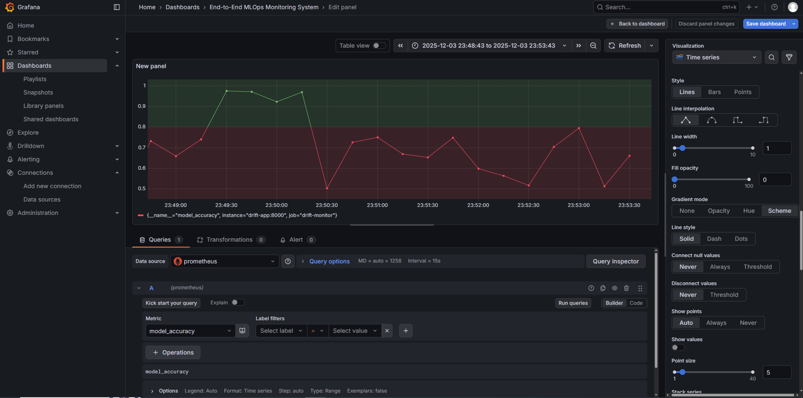

# 📉 MLOps: Real-Time Model Drift Monitor

### A Containerized Infrastructure for Monitoring AI Reliability

**The Problem:** Machine Learning models are not static. Once deployed, their accuracy often degrades over time due to changing data patterns—a phenomenon known as "Model Drift."

**The Solution:** This project is a full-stack MLOps solution that simulates a production AI model, tracks its performance in real-time using **Prometheus**, and triggers visual alerts via **Grafana** when accuracy drops below a safety threshold.

---

## 🏗️ Architecture

The system is composed of three microservices orchestrated via **Docker Compose**:

1.  **The AI Simulator (Python):** * Simulates a live ML model.
    * **Healthy State:** Generates accuracy between 90-99%.
    * **Drift State:** After 60 seconds, performance degrades to 50-80%.
    * **Exporter:** Uses `prometheus_client` to expose metrics on port `8000`.
2.  **Prometheus (Time-Series Database):**
    * Scrapes the Python app every 5 seconds.
    * Stores historical accuracy data.
3.  **Grafana (Visualization):**
    * Connects to Prometheus.
    * Visualizes the accuracy drop in real-time.
    * Visualizes threshold breaches (Alerting).

---

## 🛠️ Tech Stack

* **Language:** Python 3.9
* **Containerization:** Docker & Docker Compose
* **Monitoring:** Prometheus
* **Visualization:** Grafana
* **Libraries:** `prometheus-client`

---

## 🚀 How to Run

### Prerequisites
* Docker Desktop installed and running.

### Installation
1.  Clone the repository:
    ```bash
    git clone https://github.com/TouseefQ/drift-monitor.git
    cd drift-monitor
    ```

2.  Start the infrastructure:
    ```bash
    docker-compose up --build
    ```

3.  Access the services:
    * **App Metrics:** `http://localhost:8000`
    * **Prometheus:** `http://localhost:9090`
    * **Grafana:** `http://localhost:3000` (User: `admin` / Pass: `admin`)

---

## 📊 Dashboard Setup

To reproduce the monitoring dashboard:

1.  Open Grafana (`localhost:3000`).
2.  Add **Prometheus** as a Data Source.
    * URL: `http://prometheus:9090` (Note: internal Docker DNS).
3.  Create a new Dashboard and use the query:
    ```promql
    model_accuracy
    ```
4.  Set a Threshold at **0.80**. You will see the graph turn red when the simulator enters the "Drift" phase.

---

## 📸 Screenshots



---

## 🧠 What I Learned
* **Container orchestration:** How to link Python apps with monitoring infrastructure using Docker networks.
* **Observability:** The importance of instrumenting code to expose internal metrics (White-box monitoring).
* **Infrastructure as Code:** Defining the entire stack in a single `docker-compose.yml` file.